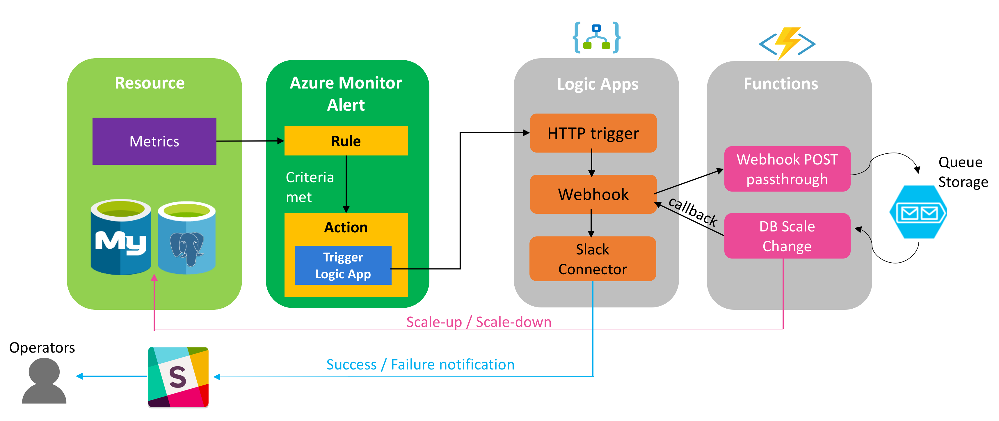

# azure-database-scaler
Event driven Azure Logic App & Functions App that scale-up or scale-down the capacity of your Azure database service instance (Currently only vCore # is supported)

### Targets Azure Databases to scale in this project:
- [Azure Database for MySQL](https://azure.microsoft.com/en-us/services/mysql/)
- [Azure Database for PostgreSQL](https://azure.microsoft.com/en-us/services/postgresql/)

### What to scale up/down?
- vCores ([What is vCore?](https://docs.microsoft.com/en-us/azure/mysql/concepts-pricing-tiers#compute-generations-vcores-and-memory))
- Storage Size ([What is Storage size?](https://docs.microsoft.com/en-us/azure/mysql/concepts-pricing-tiers#storage))

### How to scale up/down?
- azure-database-scaler starts changing vCore capacity or Storage size when it was triggered by Azure Monitor Metric Alerts (Alerts providers must be either `Microsoft.DBforMySQL` or `Microsoft.DBforPostgreSQL`)
- azure-database-scaler scale-up or scale-down the number of vCore within the same database tier & the same compute generations (Gen4 / Gen5) of your instance in the way like:
    - Basic Tier: 1 <-> 2
    - General Purpose Tier: 2 <-> 4 <-> 8 <-> 16 <-> 32
    - Memory Optimized Tier: 2 <-> 4 <-> 8 <-> 16 <-> 32
- azure-database-scaler only scale-up the Storage size (Not scale-down supported). It can increase the Storage size by the amount of `StorageScaleupSize`(GB) parameter value to specify in [project config file](scripts/project.conf) for each scale-up action triggered by Azure Monitor Metric Alerts until the Storage size reaches `MaxStorageScaleLimit`(GB) parameter value to specify in [project config file](scripts/project.conf). `MaxStorageScaleLimit`(GB) should be within the follwoing storage size range:
    - Basic Tier: 5 GB to 1 TB (1024 GB)
    - General Purpose Tier: 5 GB to 2 TB (2048 GB)
    - Memory Optimized Tier: 5 GB to 2 TB (2048 GB)

### Alert Metrics, Alert Operator, and Actions

|Alert Metric|Metric display name | Operators to match | Action |
|---|---|---|---|
|`cpu_percent`|CPU percent| `GreaterThan` or `GreaterThanOrEqual` | scale-up vCore capacity|
|`cpu_percent`|CPU percent| `LessThan` or `LessThanOrEqual` | scale-down vCore capacity|
|`storage_percent`|Storage percent| `GreaterThan` or `GreaterThanOrEqual` | scale-up Storage size|
|`storage_used`|Storage used| `GreaterThan` or `GreaterThanOrEqual` | scale-up Storage size|
|`storage_limit`|Storage limit| `GreaterThan` or `GreaterThanOrEqual` | scale-up Storage size|

For the detail on the supported metrics, please see [supported metrics for Azure Database for MySQL](https://docs.microsoft.com/en-us/azure/monitoring-and-diagnostics/monitoring-supported-metrics#microsoftdbformysqlservers) or [supported metrics for Azure Database for PostgreSQL](https://docs.microsoft.com/en-us/azure/monitoring-and-diagnostics/monitoring-supported-metrics#microsoftdbforpostgresqlservers)

### Architecture:

Relevant Services:
- [Azure Database for MySQL](https://azure.microsoft.com/en-us/services/mysql/)
- [Azure Database for PostgreSQL](https://azure.microsoft.com/en-us/services/postgresql/)
- [Azure Functions](https://azure.microsoft.com/en-us/services/functions/)
- [Azure Logic Apps](https://azure.microsoft.com/en-us/services/logic-apps/)
- [Azure Monitor Alerts (Classic)](https://docs.microsoft.com/en-us/azure/monitoring-and-diagnostics/monitoring-overview-alerts)
- [Azure Monitor Alerts (New)](https://docs.microsoft.com/en-us/azure/monitoring-and-diagnostics/monitoring-overview-unified-alerts)
- [Slack (for notification)](https://slack.com)

## Documents
- [How to deploy the database scaler app](./docs/HOW-TO-DEPLOY-APP.md)
- [How to setup Azure Monitor Metric Alerts for Autoscaling(Classic Metric Alert)](./docs/HOW-TO-SETUP-ALERTS.md)

