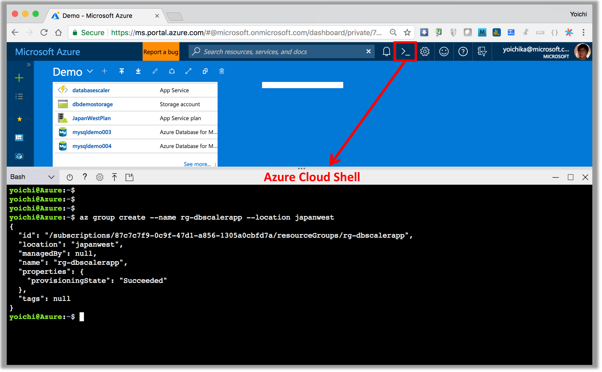
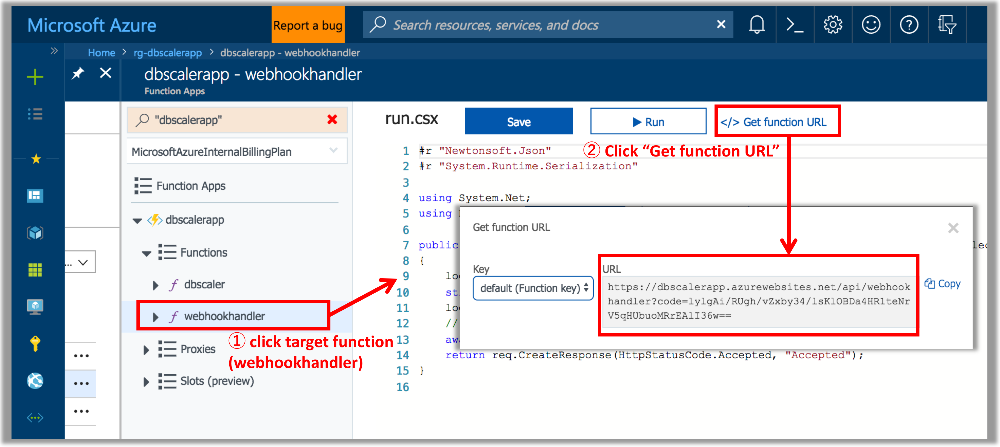
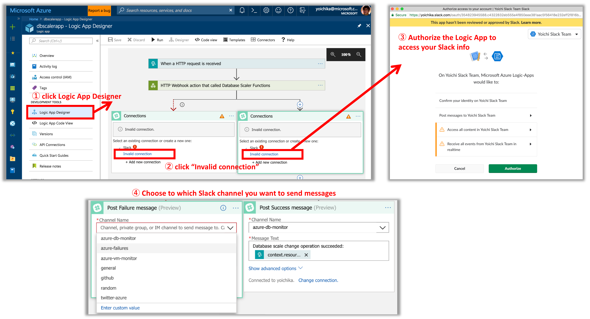

# How to deploy the demo application

## Prerequisites
You can run this walkthrough on Linux (of course, Azure Cloud Shell Bash) or Mac OS. Maybe Bash on Windows too but not tested yet

- You need an Azure subscription. If you don't have one, you can [sign up for an account](https://azure.microsoft.com/).
- Install the [Azure CLI 2.0](https://docs.microsoft.com/en-us/cli/azure/install-azure-cli?view=azure-cli-latest)
```
pip install -U azure-cli
```
[NOTE] you can skip azure-cli installation if you execute bash commands from [Azure Cloud Shell](https://docs.microsoft.com/en-us/azure/cloud-shell/overview). I recommend you to use [Azure Cloud Shell Bash](https://docs.microsoft.com/en-us/azure/cloud-shell/overview) as it's browser based and you can run anywhere




## Create Resources and Deploy applications

### 1. Create Resource Group
Create resource group for the demo (ie.,Resource group named `rg-dbscalerapp` in `japanwest` region):
```
az group create --name rg-dbscalerapp --location japanwest
```

### 2. Service principal for the app

Create a Service Principal with the following Azure CLI command:
```
az ad sp create-for-rbac --role Contributor
```
Output should be similar to the following. Take note of the appId, password, and tenant values, which you use in the next step.

```
{
  "appId": "333bfe4e-e98c-4d78-adb1-947d45296caa",         # to clientId in project.conf
  "displayName": "azure-cli-2018-04-28-02-12-13",
  "name": "http://azure-cli-2018-04-28-02-12-13",
  "password": "3d3f4303-ca12-4c29-94a7-e5bde0c1f8c1",      # to clientSecret in project.conf
  "tenant": "72f988bf-86f1-41af-91ab-2d7cd011db47"         # to tenantId in project.conf
}
```

### 3. Clone the project source code from Github and edit project.conf

Clone the project source code from Github
```
git clone https://github.com/yokawasa/azure-database-scaler.git
```

Then, open `project.conf` and add all except `WebhookSubscribeAPIEndpoint` parameters in project.conf.
- azure-database-scaler/scripts/[project.conf](../scripts/project.conf)
```
#=============================================================
# Azure Database Scaler App Configuration file
#=============================================================
# Commons
ResourceGroup="<Resource group for the project>"
ResourceLocation="<Resource Region name (ex. japaneast)>"
SubscriptionId="<Azure Subscription ID>"
TenantId="<Service Principal Tenant Domain>"
ClientId="<Service Principal Client Id>"
ClientSecret="<Service Principal Client Secret>"

# Functions App
FunctionsAppName="<Function App Name>"
FunctionsAppConsumptionPlanLocation="<Location/Region name for running function apps>"
WebhookSubscribeAPIEndpoint="https://${FunctionsAppName}.azurewebsites.net/api/webhookhandler?code=xxx"

# Logic App
LogicAppName="<Logic App Name>"

# Storage Account for the App
StorageAccountName="<Storage Account Name>"

# Database Admin/Login User in Azure Database Services (MySQL/PostgreSQL)
DatabaseAdminUser="<Database Admin/Login User Name in your Azure Database service>"
DatabaseAdminPassword="<Database Admin User Password in your Azure Database service>"
```
[NOTE] Your Functions App, LogicApp, and Storage Account names must be unique within Azure.

### 4. Create Azure Steorage Account

Create Azure Storage Account for the app  by running a following scirpt:
```
scripts/setup-storage.sh
```

### 5. Create Azure functions account and deploy functions app
Create Azure Functions Account and deploy functions apps into the account by running a following scirpt:
```
scripts/setup-functions.sh
```

### 6. Get webhookhandler function URL and update project.conf

Get the following functions' URLs (scheme + host/path + query) in the Azure Portal:
- webhookhandler

Here is how you get get-sas-token function's URL.


Once you get `webhookhandler` function URL, replace `WebhookSubscribeAPIEndpoint` value with `webhookhandler` function URL in `project.conf` like this:
```
WebhookSubscribeAPIEndpoint="https://dbscalerapp.azurewebsites.net/api/webhookhandler?code=lylgAi/RUgh/vZxby34/lsKlOBDa4HR1teNrV5qHUbuoMRrEAlI36w=="
```

### 7. Deploy Azure Logic App

Create Azure Logic App Account and deploy a workflow to the account by running a following scirpt:
```
scripts/setup-logicapp.sh
```

### 8. Authorize the logic app to access your Slack account


