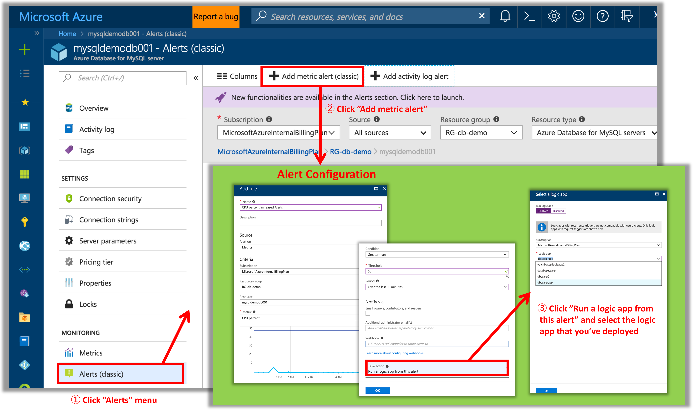

# How to setup Azure Alerts for Azure Database autoscaling

For more detail on the Azure Monitor Metric Alert setup, please see the following page:
- [Use the Azure portal to set up alerts on metrics for Azure Database for MySQL](https://docs.microsoft.com/en-us/azure/mysql/howto-alert-on-metric)